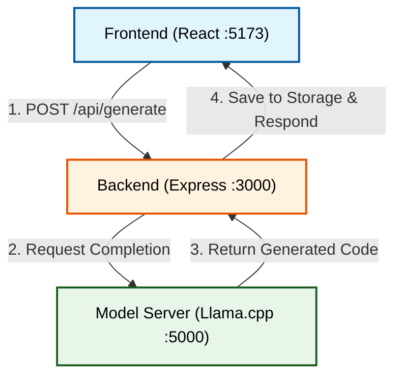

# WebJanak

WebJanak is a locally hosted, AI-powered Text-to-UI generator. It allows users to describe an interface in natural language and receive fully functional, styled HTML/CSS/JS code.

## Key Features
* **Local Inference**: Runs entirely on the user's machine using optimized GGUF models, ensuring privacy and zero cost.
* **Live Preview**: Instantly renders the generated code in an interactive iframe.
* **Code Editing**: Users can modify the generated code directly in the browser, with the preview updating in real-time.
* **Downloadable Output**: Generated projects can be downloaded as standalone HTML files.
* **Project History**: Automatically saves generated projects for later retrieval.
* **Responsive Views**: Toggle between Desktop, Tablet, and Mobile views to ensure responsiveness.
* **Multi-language Support**: Interface supports Hindi and English.

## TOOLS & TECHNOLOGY USED
* **Frontend**: React 19, Vite, vanilla CSS.
* **Backend**: Node.js, Express.js.
* **AI Model Inference**: llama.cpp (specifically llama-server.exe) for high-performance CPU/GPU inference.
* **Model**: Fine-tuned Qwen model (converted to GGUF format with LoRA adapters).
* **Utilities**: PrismJS (syntax highlighting), fs-extra (file operations).

## How It Looks

## How to Setup
Run simply `start_all.bat` 

OR 

1. Run `start_model.bat`
2. `npm start` in terminal
3. `.\cd client` and `npm run dev` in another terminal

## SYSTEM ARCHITECTURE & DATA FLOW

## FUTURE SCOPE {you can contribute}
1. **Component Generation**: Move from single HTML files to generating modular React components (.jsx + .css).
2. **Visual Builder**: Implement a drag-and-drop editor alongside the code editor for hybrid workflows.
3. **Multi-File Projects**: Support generating complex apps with multiple pages and router configurations.
4. **Model Optimization**: Further fine-tuning of the Qwen model on larger, more diverse UI datasets to improve aesthetic quality and code correctness.
5. **Image-to-Code**: Integrate vision capabilities to allow users to upload sketches and convert them to code.
